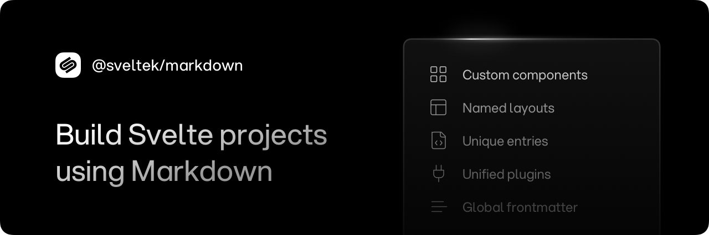

<p align="center">
  
</p>

<h1 align="center">@sveltek/markdown</h1>

<p align="center">Svelte Markdown Preprocessor.</p>

<br>

> [!NOTE]
>
> While the **API** is solid and mostly complete, some changes may still occur before the first stable release.
>
> Ideas, [suggestions](https://github.com/sveltek/markdown/discussions) and code [contributions](.github/CONTRIBUTING.md) are welcome.
>
> If you find any issues or bugs, please [report](https://github.com/sveltek/markdown/issues/new/choose) them so the project can be improved.

<br>

## Core Concepts

- **Custom Components:** Simplifies development by supporting `import`/`export` of reusable components.
- **Named Layouts:** Provides a powerful named `layout` mechanism to completely customize page design.
- **Unique Entries:** Defines specialized, `entry-level` configuration adapted for all markdown files.
- **Unified Plugins:** Enables content transformation using widely-adopted tools like `remark` and `rehype`.
- **Global Frontmatter:** Streamlines workflow by offering centralized options for markdown `metadata`.
- **Special Elements:** Supports parsing Svelte special elements such as `svelte:head` etc. in markdown files.
- **Code Highlighter:** Offers quick and easy customization for `syntax highlighting`.

## Intro

**Svelte Markdown** has been completely rewritten to take full advantage of `Svelte 5` and its `Runes` mode.

It’s a light, simple and powerful preprocessor designed specifically for managing `Markdown` content within `Svelte` projects.

Also, it comes with zero-config setup, built-in types and a dev-friendly API.

## Docs

The plan is to create online docs soon, so until its published, feel free to ask questions or share feedback in the official [Discussions](https://github.com/sveltek/markdown/discussions).

## Installation

```sh
# via pnpm
pnpm add -D @sveltek/markdown
```

```sh
# via npm
npm install -D @sveltek/markdown
```

## Usage

### Zero-Config Setup

```js
// svelte.config.js

import adapter from '@sveltejs/adapter-static'
import { svelteMarkdown } from '@sveltek/markdown'

/** @type {import('@sveltejs/kit').Config} */
const config = {
  preprocess: [svelteMarkdown()],
  extensions: ['.svelte', '.md'],
  kit: { adapter: adapter() },
}

export default config
```

### Custom Config Setup

```js
// markdown.config.js

import { defineConfig } from '@sveltek/markdown'

export const markdownConfig = defineConfig({
  frontmatter: {
    defaults: {
      layout: 'default',
      author: {
        name: 'Sveltek',
        url: 'https://github.com/sveltek',
      },
      // other global data...
    },
  },
  layouts: {
    default: {
      path: 'lib/content/layouts/default/layout.svelte',
    },
    blog: {
      path: 'lib/content/layouts/blog/layout.svelte',
      plugins: {
        remark: [],
        rehype: [],
      },
    },
    // other layouts...
  },
})
```

Import the config to the `svelte.config.js` file:

```js
// svelte.config.js

import adapter from '@sveltejs/adapter-static'
import { svelteMarkdown } from '@sveltek/markdown'
import { markdownConfig } from './markdown.config.js'

/** @type {import('@sveltejs/kit').Config} */
const config = {
  preprocess: [svelteMarkdown(markdownConfig)],
  extensions: ['.svelte', '.md'],
  kit: { adapter: adapter() },
}

export default config
```

### Types

If you work with `TypeScript` and `Markdown` components, you can define types to avoid potential issues when importing `.md` into `.svelte` files.

```ts
// src/app.d.ts

declare global {
  namespace App {
    declare module '*.md' {
      import type { Component } from 'svelte'

      declare const MarkdownComponent: Component

      export default MarkdownComponent
    }
  }
}

export {}
```

Now you can import `.md` file into `.svelte` without type errors:

```html
<!-- +page.svelte -->

<script lang="ts">
  import Comp from '$lib/content/components/comp.md'
</script>

<Comp />
```

## Examples

> [!NOTE]
>
> More examples will be added to the online docs.

### Playground

Explore the [playground](https://github.com/sveltek/markdown/tree/main/playgrounds/sveltekit) to see more details.

### Custom Components

```markdown
---
title: Page Title
---

<script lang="ts">
  import { Component } from '$lib/components'
</script>

<Component />

<Component prop="data" />

<Component>
Children content
</Component>

Content...
```

```markdown
---
title: Page Title
---

<script lang="ts">
  import { Component } from '$lib/components'
</script>

::Component

::Component prop="data"

::Component
Children content
::

Content...
```

### Named Layouts

```markdown
---
title: Page Title
layout: default
---

Content...
```

```markdown
---
layout: false
---

Content...
```

### Unique Entries

```markdown
---
title: Page Title
entry: blog
---

Content...
```

```markdown
---
entry: false
---

Content...
```

### Special Elements

```markdown
---
title: About page
description: Svelte Markdown Preprocessor.
layout: false
specialElements: true
---

<svelte:head>

  <title>Custom Title - {title}</title>
  <meta name="description" content={`Custom Description - ${description}`} />
</svelte:head>

<style>
  p { 
    opacity: 0.6;
    font-family: monospace;
    font-size: 1.125rem;
  }
</style>

{description}

Content...
```

## Code Highlighting

### Shiki Syntax Highlighter

#### rehypeShiki plugin

Recommended way is to simply import the official `rehypeShiki` plugin from `@sveltek/unplugins`.

It's super flexible and easy, you can apply it to just one page, to specific layouts, or to all pages if needed.

Plugin works without additional configuration, but if you want you can configure it further via plugin options.

> Install the required dependencies before use.
>
> ```sh
> pnpm add -D @sveltek/unplugins shiki
> ```

```ts
import { svelteMarkdown } from '@sveltek/markdown'
import { rehypeShiki } from '@sveltek/unplugins'

svelteMarkdown({
  plugins: {
    rehype: [[rehypeShiki, { theme: 'github-light-default' }]],
  },
})
```

#### highlight option

It is also possible to use the `highlight` option which is a powerful way if you need more advanced configuration, but this require manual setup. Keep in mind that this applies to all pages, so it may not be desirable in every case.

> Install the required dependencies before use.
>
> ```sh
> pnpm add -D shiki
> ```

```ts
import { createHighlighter } from 'shiki'

const theme = 'github-dark-default'
const highlighter = await createHighlighter({
  themes: [theme],
  langs: ['javascript', 'typescript', 'svelte'],
})

svelteMarkdown({
  highlight: {
    highlighter: async ({ lang, code }) => {
      return highlighter.codeToHtml(code, { lang, theme })
    },
  },
})
```

## Plugins

### Remark Table of Contents (Toc)

> Install the required dependencies before use.
>
> ```sh
> pnpm add -D @sveltek/unplugins
> ```

```js
import { remarkToc } from '@sveltek/unplugins'

svelteMarkdown({
  plugins: {
    remark: [remarkToc],
  },
})
```

Usage in markdown page:

```markdown
---
title: Blog page
description: Read the latest news.
---

## What's New

## Featured Posts

<ul>
  {#each frontmatter.toc as toc}
    <li><a href="#{toc.id}">{toc.value}</a></li>
  {/each}
</ul>
```

### Remark Reading Stats

```ts
import { visit, CONTINUE } from 'unist-util-visit'
import readingTime from 'reading-time'
import type { Frontmatter } from '@sveltek/markdown'
import type { Plugin, Mdast } from '@sveltek/unplugins'

/**
 * Estimates how long an article will take to read.
 */
export const remarkReadingStats: Plugin<[], Mdast.Root> = () => {
  return (tree, file) => {
    const frontmatter = file.data.frontmatter as Frontmatter

    let text = ''

    visit(tree, ['text', 'code'], (node) => {
      if (node.type !== 'text' && node.type !== 'code') return CONTINUE

      text += node.value

      frontmatter.readingStats = readingTime(text)
    })
  }
}
```

Config:

```js
svelteMarkdown({
  plugins: {
    remark: [remarkReadingStats],
  },
})
```

Usage in markdown page:

```markdown
---
title: Page title
---

Reading stats: {JSON.stringify(readingStats)}

# returns an object: { text: '1 min read', minutes: 1, time: 60000, words: 200 }

Reading time: {readingStats.text}

# returns an string: '1 min read'
```

## API

```ts
import { svelteMarkdown, defineConfig, compile } from '@sveltek/markdown'

import { escapeSvelte } from '@sveltek/markdown/utils'
```

### preprocessor

- Type: `function svelteMarkdown(config?: MarkdownConfig): PreprocessorGroup`

```ts
import { svelteMarkdown } from '@sveltek/markdown'

svelteMarkdown(config)
```

### defineConfig

- Type: `function defineConfig(config: MarkdownConfig): MarkdownConfig`

```ts
import { defineConfig } from '@sveltek/markdown'

defineConfig(config)
```

### compile

- Type: `function compile(source: string, options: CompileOptions): Promise<Processed>`

```ts
import { compile } from '@sveltek/markdown'

compile(source, options)
```

### escapeSvelte

- Type: `function escapeSvelte(value: string): string`

```ts
import { escapeSvelte } from '@sveltek/markdown/utils'

escapeSvelte(value)
```

## Types

### main

Imports all types from the main package.

```ts
import type {
  ASTScript,
  CompileOptions,
  Entries,
  Entry,
  FileData,
  Frontmatter,
  Highlight,
  Layout,
  Layouts,
  MarkdownConfig,
  Plugin,
  PluginList,
  Plugins,
} from '@sveltek/markdown'
```

## Options

All options are documented with descriptions and examples so autocompletion will be offered as you type. Simply hover over the property and see what it does in the quick info tooltip.

### extensions

- Type: `string[]`
- Default: `['.md']`

Specifies custom file extensions.

```ts
svelteMarkdown({
  extensions: ['.md'],
})
```

### preprocessors

- Type: `PreprocessorGroup[]`
- Default: `undefined`

Specifies a custom list of preprocessors that will be applied to a Svelte file.

```ts
svelteMarkdown({
  preprocessors: [vitePreprocess()],
})
```

### plugins

- Type: `{ remark: [], rehype: [] }`
- Default: `undefined`

Specifies the **top-level** plugins that will be used for all markdown files.

- **Lifecycle:** `plugins` → `layout.plugins` → `entry.plugins`

```ts
svelteMarkdown({
  plugins: {
    remark: [], // Specifies custom `remark` plugins at the top-level (optional).
    rehype: [], // Specifies custom `rehype` plugins at the top-level (optional).
  },
})
```

Also, plugins can be disabled at the **file-level**:

```markdown
---
title: Page title
plugins:
  remark: false # Disables remark plugins for this file only
  rehype: false # Disables rehype plugins for this file only
---

Content...
```

### layouts

- Type: `Record<string, Layout>`
- Default: `undefined`

Specifies a custom layout records.

Layout component serves as a wrapper for the markdown files, which means the page content is displayed via the component's children prop.

- **Lifecycle:** `plugins` → `layout.plugins` → `entry.plugins`

```ts
svelteMarkdown({
  layouts: {
    default: {
      path: 'lib/content/layouts/default/layout.svelte', // Specifies the path to the layout file (required).
      plugins: {
        remark: [], // Specifies custom `remark` plugins at the layout-level (optional).
        rehype: [], // Specifies custom `rehype` plugins at the layout-level (optional).
      },
    },
    blog: {
      path: 'lib/content/layouts/blog/layout.svelte',
    },
  },
})
```

Can be enabled at the **top-level** (via config) or at the **file-level** (via frontmatter).

**File-level**

```markdown
---
title: Page title
layout: blog
---

Content...
```

Also, layout plugins can be disabled at the **file-level**:

```markdown
---
title: Page title
layout:
  name: blog
  plugins:
    remark: false # Disables remark layout plugins for this file only
    rehype: false # Disables rehype layout plugins for this file only
---

Content...
```

**Config**

```ts
svelteMarkdown({
  frontmatter: {
    defaults: {
      layout: 'default',
    },
  },
})
```

### entries

- Type: `Record<string, Entry>`
- Default: `undefined`

Specifies a custom entry records.

Entry serves as a special configuration for markdown files, which means it is similar to layout but without the need to create a custom component file.

Allows unique and straightforward customization for an individual markdown file. An entry can be a page or a component.

- **Lifecycle:** `plugins` → `layout.plugins` → `entry.plugins`

```ts
svelteMarkdown({
  entries: {
    blog: {
      plugins: {
        remark: [], // Specifies custom `remark` plugins at the entry-level (optional).
        rehype: [], // Specifies custom `rehype` plugins at the entry-level (optional).
      },
    },
  },
})
```

Can be enabled at the **top-level** (via config) or at the **file-level** (via frontmatter).

**File-level**

```markdown
---
title: Page title
entry: blog
---

Content...
```

Also, entry plugins can be disabled at the **file-level**:

```markdown
---
title: Page title
entry:
  name: blog
  plugins:
    remark: false # Disables remark entry plugins for this file only
    rehype: false # Disables rehype entry plugins for this file only
---

Content...
```

**Config**

```ts
svelteMarkdown({
  frontmatter: {
    defaults: {
      entry: 'default',
    },
  },
})
```

### frontmatter

- Type: `object`
- Default: `undefined`

Defines frontmatter custom options.

By default, frontmatter only supports the `YAML` format, but allows additional customization via parser.

#### defaults

- Type: `Record<string, unknown>`
- Default: `undefined`

Specifies frontmatter global data to be applied to all markdown files.

```ts
svelteMarkdown({
  frontmatter: {
    defaults: {
      author: 'Sveltek',
    },
  },
})
```

#### marker

- Type: `string`
- Default: `-`

Specifies the **start/end** symbols for the frontmatter content block.

It only works in combination with the default parser.

```ts
svelteMarkdown({
  frontmatter: {
    marker: '+',
  },
})
```

#### parser

- Type: `(value: string) => Record<string, unknown> | void`
- Default: `undefined`

Specifies a custom parser for frontmatter.

Allows adaptation to other formats such as `TOML` or `JSON`.

```ts
svelteMarkdown({
  frontmatter: {
    parser: (file) => {
      // ...
    },
  },
})
```

### highlight

- Type: `object`
- Default: `undefined`

Defines custom syntax highlighting options.

#### highlighter

- Type: `(data: HighlightData) => Promise<string | undefined> | string | undefined`
- Default: `undefined`

Specifies custom syntax highlighter.

```ts
svelteMarkdown({
  highlight: {
    highlighter: async ({ lang, meta, code }) => {
      // ...
      return code
    },
  },
})
```

### specialElements

- Type: `boolean`
- Default: `undefined`

Specifies support for parsing Svelte `special` elements such as [`svelte:head`](https://svelte.dev/docs/svelte/svelte-head) etc. in markdown files.

Can be enabled at the **top-level** (via config) or at the **file-level** (via frontmatter).

If you don't plan to use them in every markdown file, it is recommended to enable the option only on those pages where you really need it.

**File-level**

```markdown
---
title: Page title
specialElements: true
---

<svelte:head>...</svelte:head>

Content...
```

**Config**

```ts
svelteMarkdown({
  frontmatter: {
    defaults: {
      specialElements: true,
    },
  },
})
```

## Credits

- Inspired by [MDsveX](https://github.com/pngwn/MDsveX)

## Community

Feel free to ask questions or share new ideas.

Use the official [discussions](https://github.com/sveltek/markdown/discussions) to get involved.

## Contribute

Check out the quick [guide](.github/CONTRIBUTING.md) for more info.

## License

Developed in 🇭🇷 Croatia, © Sveltek.

Released under the [MIT](LICENSE.txt) license.
